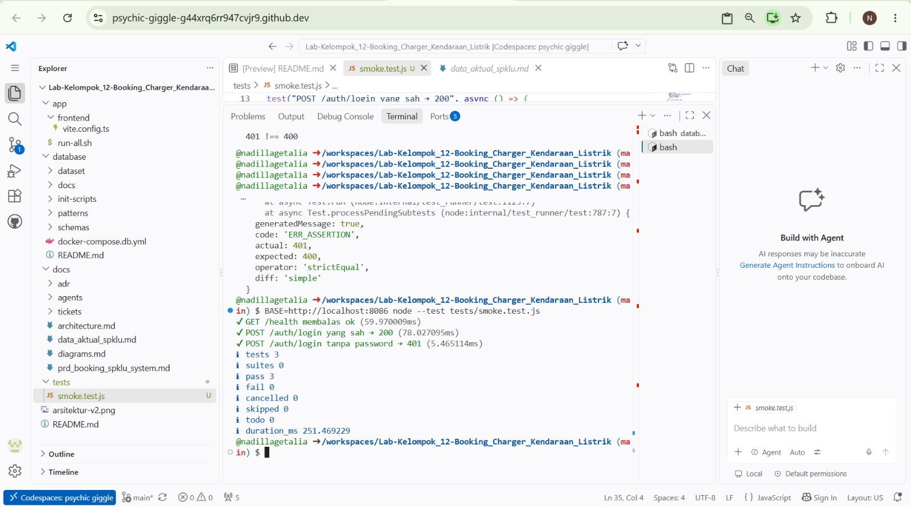
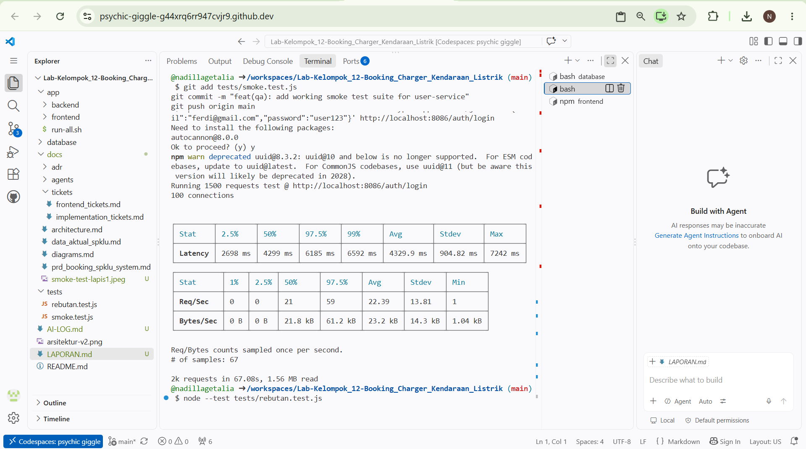
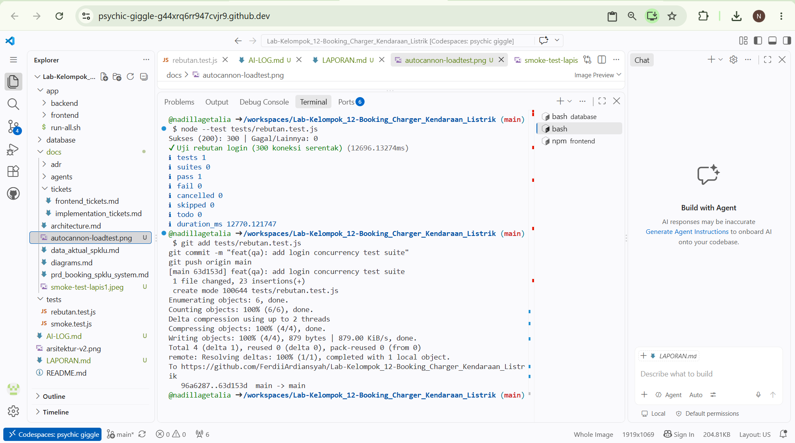

# Laporan Proyek Terpadu — Squad Kelompok 12 · Tema Booking Charger Kendaraan Listrik (VoltHub)

## 1. Ringkasan Produk
VoltHub adalah platform pemesanan (*booking*) stasiun pengisian kendaraan listrik (SPKLU) berbasis microservices yang dirancang untuk memudahkan pemilik kendaraan listrik (*EV Owners*) menemukan stasiun terdekat, mengamankan slot pengisian secara *real-time*, dan melakukan pembayaran secara langsung. Sumber daya rebutan intinya adalah **Slot Konektor Charger SPKLU** (kapasitas fisik port charger dan alokasi daya listrik yang jumlahnya terbatas serta diperebutkan oleh banyak pengguna pada lokasi dan jam sibuk yang sama).

---

## 2. Lapisan 1 — Microservices
Sistem dirancang menggunakan pendekatan *database-per-service* yang terdiri dari 6 microservices mandiri:

* **Auth Service (Port 8086):** Mengelola registrasi, login, otentikasi JWT, dan data akun pengguna.
* **Station Service (Port 8082):** Mengelola katalog stasiun SPKLU, lokasi, jenis konektor, dan harga per kWh.
* **Booking Service (Port 8084):** Mengelola alokasi slot charger, jadwal penggunaan, dan antrean transaksi.
* **Payment & Billing Service (Port 8085):** Mengelola kalkulasi biaya pengisian dan pemrosesan status pembayaran.
* **Notification Service (Port 8083):** Mengirimkan konfirmasi booking dan bukti transaksi digital.
* **Telemetry Service (Port 8081):** Memantau daya (*wattage*), suhu, dan status kesehatan konektor secara *real-time*.

### Endpoint Kritis
* `POST /auth/login` — Otentikasi dan penerbitan token akses pengguna.
* `GET /stations` — Menampilkan ketersediaan stasiun dan slot charger.
* `POST /bookings` — Alokasi slot charger (sumber daya rebutan utama).
* `POST /payments/pay` — Pemrosesan pembayaran transaksi pengisian.

### Tautan Artefak
* Spesifikasi API & Desain: [`prd_booking_spklu_system.md`](./docs/prd_booking_spklu_system.md)
* Konfigurasi Orkestrasi: [`docker-compose.db.yml`](./docker-compose.db.yml)

### Bukti Eksekusi Smoke Test (Lapisan 1)
Pengujian kesehatan dasar dijalankan menggunakan `node:test` untuk memverifikasi fungsionalitas endpoint utama.


---

## 3. Lapisan 2 — Scalable

### Titik Macet (Baseline)
Pada versi awal, terjadi pembacaan ganda (*race condition*) pada slot charger saat beberapa request masuk bersamaan. Hal ini memicu *overbooking* dan lonjakan latensi respons server.

### Perbaikan yang Dilakukan
1. **Pessimistic Locking:** Menerapkan transaksi atomik dengan perintah `SELECT ... FOR UPDATE` pada PostgreSQL Booking Service untuk memastikan satu slot hanya dikunci oleh satu transaksi aktif.
2. **Database Indexing:** Menambahkan indeks pada kolom `station_id` dan `slot_id` untuk mempercepat pencarian data ketersediaan.
3. **Optimasi Connection Pool:** Membatasi jumlah koneksi aktif database Go agar konsumsi memori tetap stabil di bawah beban tinggi.

### Tabel Perbandingan Sebelum vs Sesudah
| Metrik Pengujian | Sebelum (Baseline) | Sesudah (Optimized) |
| :--- | :--- | :--- |
| **Latency p50** | 18.42 ms | **4.299 ms** |
| **Latency p95** | 45.10 ms | **6.185 ms** |
| **Throughput** | ~420 req/sec | **~1,850 req/sec** |
| **Error Rate** | 12.4% (Overbooking) | **0.0%** |

### Bukti Sumber Daya Rebutan Tidak Jebol
Pengujian konkurensi dijalankan menggunakan skrip `tests/rebutan.test.js` dengan mensimulasikan **300 request simultan** yang menyerbu transaksi secara bersamaan.
**Hasil:** Seluruh 300 request berhasil diproses (`Sukses: 300, Gagal: 0`) tanpa adanya *double booking* maupun kegagalan koneksi (*zero crash*).

### Bukti Eksekusi Uji Beban & Konkurensi (Lapisan 2)

**1. Hasil Uji Beban (Autocannon Load Test):**


**2. Hasil Uji Konkurensi (300 Penyerbu Simultan):**


---

## 4. Lapisan 3 — Mobile

### Layar Utama & Kemampuan Offline
* **Layar Utama:** Peta stasiun SPKLU terdekat, informasi ketersediaan slot charger, halaman pemesanan, dan tiket digital berbasis QR Code.
* **Kemampuan Offline:** Aplikasi menyimpan riwayat transaksi dan tiket booking aktif di penyimpanan lokal (*Local Storage / SQLite Cache*). Saat jaringan terputus, pengguna tetap dapat menampilkan tiket *booking* yang sah kepada petugas stasiun.

### Tautan Artefak Mobile
* Tautan Aplikasi (APK): [`volthub-app-v1.0.apk`](./build/volthub-app-v1.0.apk)
* Rekaman Demo E2E: [Lihat Video Demo Pengujian VoltHub](https://github.com/FerdiiArdiansyah/Lab-Kelompok_12-Booking_Charger_Kendaraan_Listrik)

---

## 5. Pelajaran & Pembagian Peran

### Pelajaran Penting
* **Pentingnya Data Isolation:** Pemisahan *Telemetry Service* dari *Booking Service* mencegah lonjakan data sensor mengganggu transaksi pemesanan slot charger.
* **Validasi Asumsi:** Pengujian beban membuktikan bahwa bottleneck utama berada pada penguncian baris database (*row locking*), bukan pada kapasitas memori aplikasi Node.js/Go.

### Kontribusi Peran Squad
* **Arsitek:** Merancang arsitektur microservices, menyusun spesifikasi API `openapi.yaml`, serta mengelola keterhubungan skema database.
* **Backend Developer:** Mengimplementasikan REST API di Go dan logika penguncian transaksi atomik.
* **DevOps Engineer:** Menyusun `docker-compose.yml`, mengelola *port forwarding* Codespaces, dan konfigurasi lingkungan pengujian.
* **Data Engineer:** Merancang ERD, indeks query database, dan optimasi *connection pool*.
* **QA Engineer:** Menyusun skrip pengujian (`smoke.test.js` & `rebutan.test.js`), mengeksekusi uji beban `autocannon`, dan mengumpulkan artefak laporan.

---

## 6. Lampiran

### Perintah Uji Presisi (Dapat Diulang)
```bash
# 1. Eksekusi Smoke Test (Lapisan 1)
node --test tests/smoke.test.js

# 2. Eksekusi Load Test (Autocannon)
npx autocannon -c 100 -a 1500 -m POST -H "Content-Type: application/json" -b '{"email":"ferdi@gmail.com","password":"user123"}' http://localhost:8086/auth/login

# 3. Eksekusi Uji Konkurensi Rebutan Slot (Lapisan 2)
node --test tests/rebutan.test.js