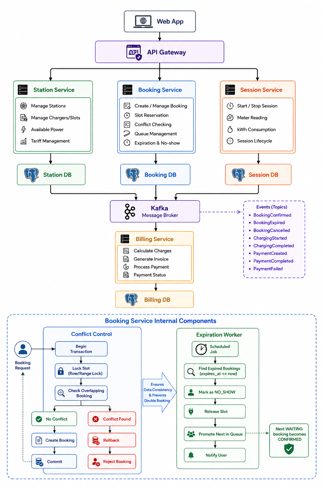

# Lab-Kelompok_12-Booking_Charger_Kendaraan_Listrik

Sistem ini dirancang untuk proses booking charger kendaraan listrik dengan kapasitas slot terbatas.

Tantangan utama:
- permintaan tinggi saat jam sibuk,
- konflik jadwal pada slot yang sama,
- no-show yang membuat slot terblokir,
- tagihan harus berdasarkan konsumsi kWh aktual.

Tujuan sistem:
- mencegah booking overlap,
- menjaga fairness antrean,
- melepas slot otomatis saat no-show,
- menghasilkan billing yang akurat dari sesi charging.

## Scope Fitur
In scope:
- manajemen stasiun, slot, daya, dan tarif,
- booking slot pada rentang waktu,
- waitlist saat kapasitas penuh,
- auto-release no-show,
- pencatatan sesi charging,
- perhitungan invoice dan pembayaran.

Out of scope (saat ini):
- dynamic pricing berbasis demand real-time,
- integrasi loyalty/coupon,
- smart load balancing antar stasiun multi-operator.

## Arsitektur yang Dipilih
Pendekatan yang digunakan adalah microservices per domain, dengan database terpisah per service dan integrasi event-driven.

Komponen utama:
- station-service: kelola stasiun, slot, daya, dan tarif.
- booking-service: kelola booking, validasi bentrok waktu, waitlist, dan auto-release no-show.
- session-service: kelola sesi charging (start, meter kWh, finish).
- billing-service: hitung invoice dari kWh dan proses pembayaran.

Prinsip desain:
- no shared database antar service,
- konsistensi kuat di booking-service untuk anti-overlap,
- eventual consistency antar service melalui event bus,
- idempotency untuk API kritikal dan consumer event.

## Service dan Tanggung Jawab

### station-service
- master data stasiun,
- data slot charger dan status operasional,
- data tarif per kWh yang berlaku.

Entitas utama:
- Station(id, name, location, totalPowerKw)
- ChargerSlot(id, stationId, connectorType, maxPowerKw, status)
- Tariff(id, stationId, pricePerKwh, validFrom)

### booking-service
- create booking,
- validasi bentrok waktu,
- proses waitlist FIFO,
- auto-release no-show.

Entitas utama:
- Booking(id, userId, stationId, slotId, startTime, endTime, status)
- Waitlist(id, stationId, requestedStart, requestedEnd, queueNumber, status)

### session-service
- mulai sesi charging,
- update meter kWh,
- selesai sesi.

Entitas utama:
- ChargingSession(id, bookingId, startedAt, endedAt, consumedKwh, status)

### billing-service
- hitung invoice dari pemakaian kWh,
- proses pembayaran,
- simpan histori invoice dan payment.

Entitas utama:
- Invoice(id, sessionId, tariffId, consumedKwh, subtotal, tax, total, status)
- Payment(id, invoiceId, method, amount, status, paidAt)

## Alur Bisnis Inti
1. User membuat booking slot pada rentang waktu tertentu.
2. booking-service mengecek konflik jadwal slot.
3. Jika slot tersedia, booking dikonfirmasi; jika penuh, user masuk waitlist.
4. User check-in lalu sesi charging dimulai di session-service.
5. Saat sesi selesai, pemakaian kWh final dipublish.
6. billing-service membuat invoice dan memproses pembayaran.

## State Booking
- REQUESTED
- CONFIRMED
- WAITLISTED
- IN_SESSION
- COMPLETED
- EXPIRED_NO_SHOW
- CANCELLED

Transisi penting:
- REQUESTED ke CONFIRMED jika slot tersedia,
- REQUESTED ke WAITLISTED jika slot penuh,
- WAITLISTED ke CONFIRMED saat dipromosikan,
- CONFIRMED ke EXPIRED_NO_SHOW jika lewat grace period,
- CONFIRMED ke IN_SESSION saat check-in dan start session.

## Mekanisme Saat Jam Sibuk
- Anti-overlap booking ditegakkan di level transaksi database.
- Request yang tidak mendapat slot masuk antrean FIFO (waitlist).
- Booking yang no-show setelah grace period akan otomatis expired.
- Slot hasil auto-release langsung dipakai untuk promosi antrean berikutnya.

Implementasi anti-overlap (direkomendasikan PostgreSQL):
- gunakan transaksi dengan isolation level kuat,
- gunakan constraint interval waktu per slot agar tidak overlap,
- tambahkan idempotency key untuk endpoint create booking.

## Konsistensi dan Reliabilitas
- Outbox pattern untuk publish event yang andal.
- Consumer event idempotent berbasis event ID/version.
- Correlation ID untuk tracing lintas service.
- Audit log untuk perubahan status booking, session, invoice, dan payment.

Event domain utama:
- BookingConfirmed
- BookingExpiredNoShow
- SessionStarted
- SessionFinished
- InvoiceCreated
- PaymentCompleted

## API Ringkas yang Disarankan

station-service:
- GET /stations
- GET /stations/{id}/slots
- GET /stations/{id}/tariff

booking-service:
- POST /bookings
- POST /bookings/{id}/check-in
- POST /bookings/{id}/cancel
- GET /stations/{id}/availability?start=&end=

session-service:
- POST /sessions/start
- POST /sessions/{id}/meter
- POST /sessions/{id}/finish

billing-service:
- GET /invoices/{id}
- POST /payments

## Kebutuhan Non-Fungsional
- Skalabilitas: service dapat scale horizontal secara independen.
- Ketersediaan: event processing tahan retry dan tidak kehilangan data.
- Keamanan: autentikasi JWT/OAuth2, mTLS antar service internal.
- Observability: metrics, logs, traces end-to-end.
- Auditability: perubahan status penting wajib tercatat.

## ADR (Architecture Decision Record)
Daftar keputusan arsitektur:
- [ADR Index](docs/adr/README.md)
- [ADR 0001 - Arsitektur Microservices Berbasis Domain](docs/adr/0001-arsitektur-microservices-domain.md)
- [ADR 0002 - Strategi Anti-overlap Booking Slot](docs/adr/0002-strategi-anti-overlap-booking-slot.md)
- [ADR 0003 - Auto-release No-show dan Waitlist Promotion](docs/adr/0003-auto-release-no-show-waitlist.md)

## Diagram
- Diagram teknis (Mermaid): [docs/diagrams.md](docs/diagrams.md)
- Ringkasan arsitektur: [arsitektur-v2.png](arsitektur-v2.png)
- Ringkasan sequence: [sequence_diagram.png](sequence_diagram.png)

### Preview Arsitektur

### Preview Sequence

## Dokumen Detail
- Detail arsitektur lengkap: [docs/architecture.md](docs/architecture.md)

## Asumsi Operasional
- Semua waktu booking disimpan dalam UTC.
- Grace period no-show ditetapkan 10-15 menit.
- Promosi waitlist mengikuti urutan FIFO dalam station dan rentang waktu terkait.
- Tarif yang dipakai billing adalah tarif aktif saat sesi selesai (atau policy yang disepakati tim).