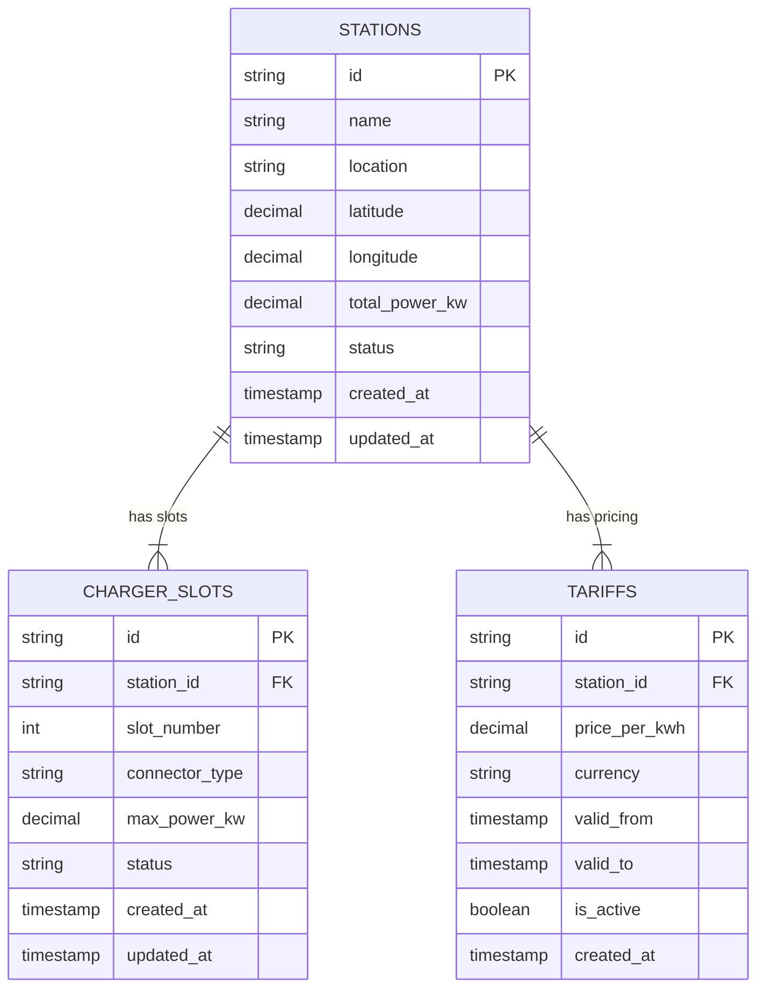
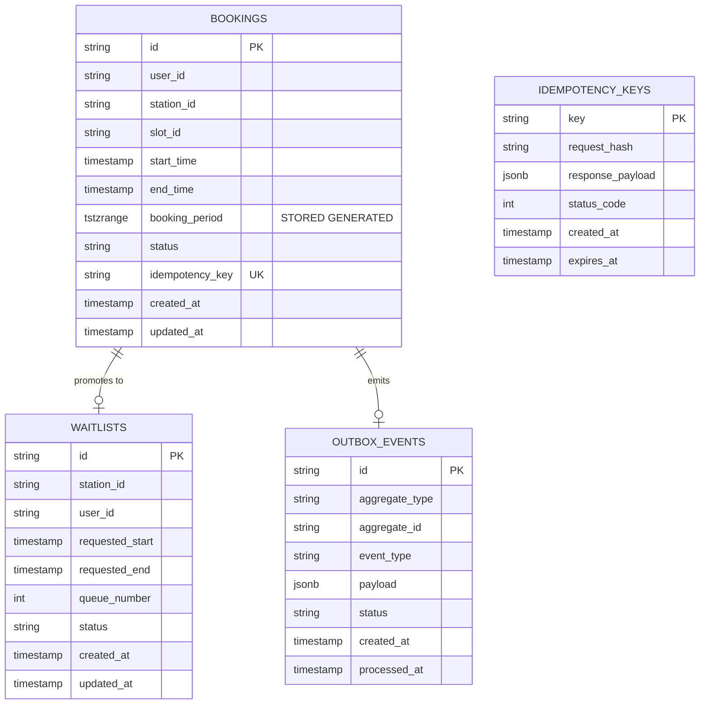
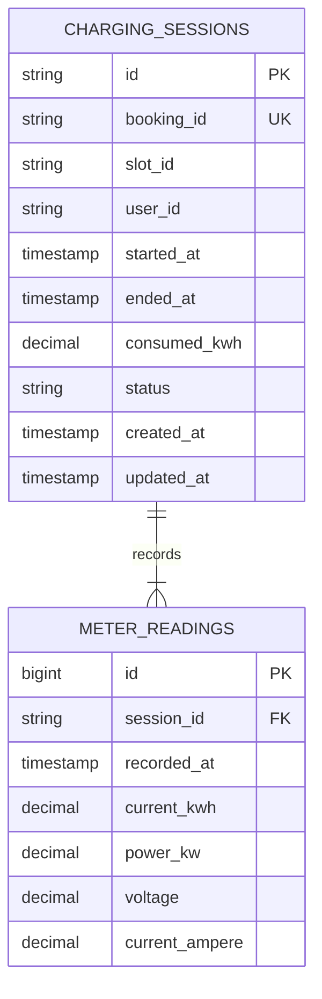
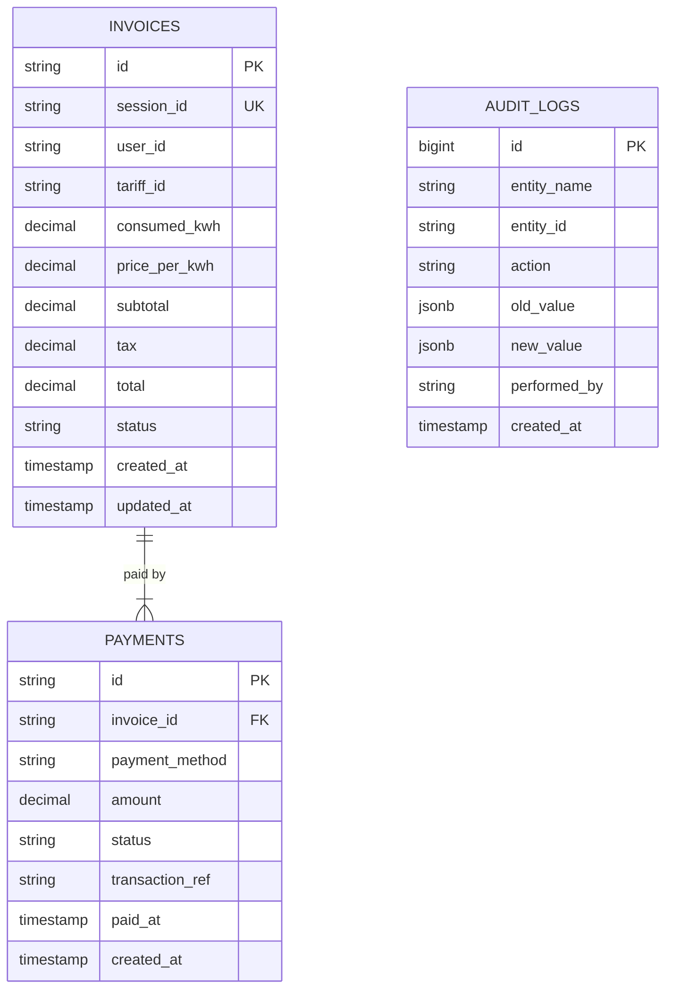

# 📐 Entity Relationship Diagram (ERD) & Database Schemas

Dokumen ini menjelaskan struktur data dan hubungan entitas di setiap database microservice yang dikelola oleh **Data & Persistence Engineer**.

---

## 1. `station_db` (station-service)

Mengelola master data stasiun pengisian listrik, slot konektor, dan struktur tarif.

---

## 2. `booking_db` (booking-service)

Mengelola booking slot, validasi jadwal bebas bentrok, antrean waitlist, dan event outbox.

---

## 3. `session_db` (session-service)

Mengelola data telemetry sesi charging real-time dan log konsumsi energi kWh.

---

## 4. `billing_db` (billing-service)

Mengelola invoice, transaksi pembayaran, log audit keuangan, dan outbox event.

