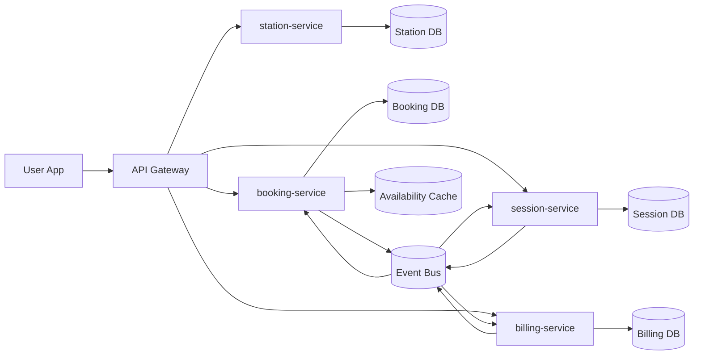
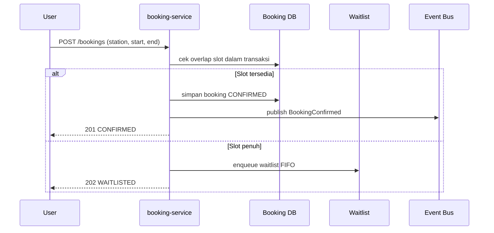
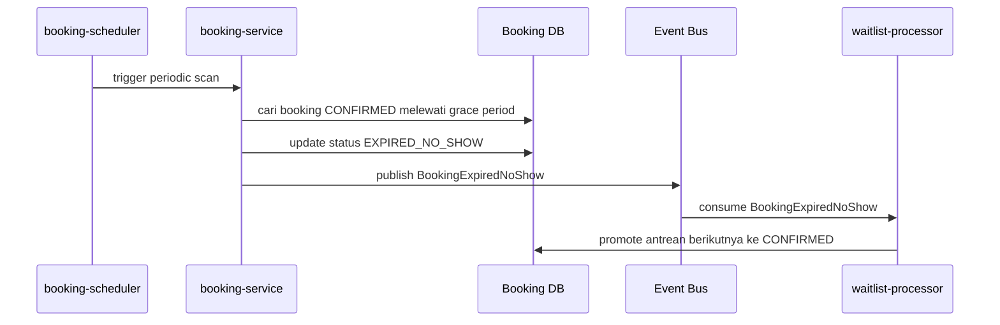
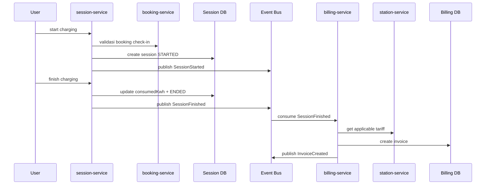
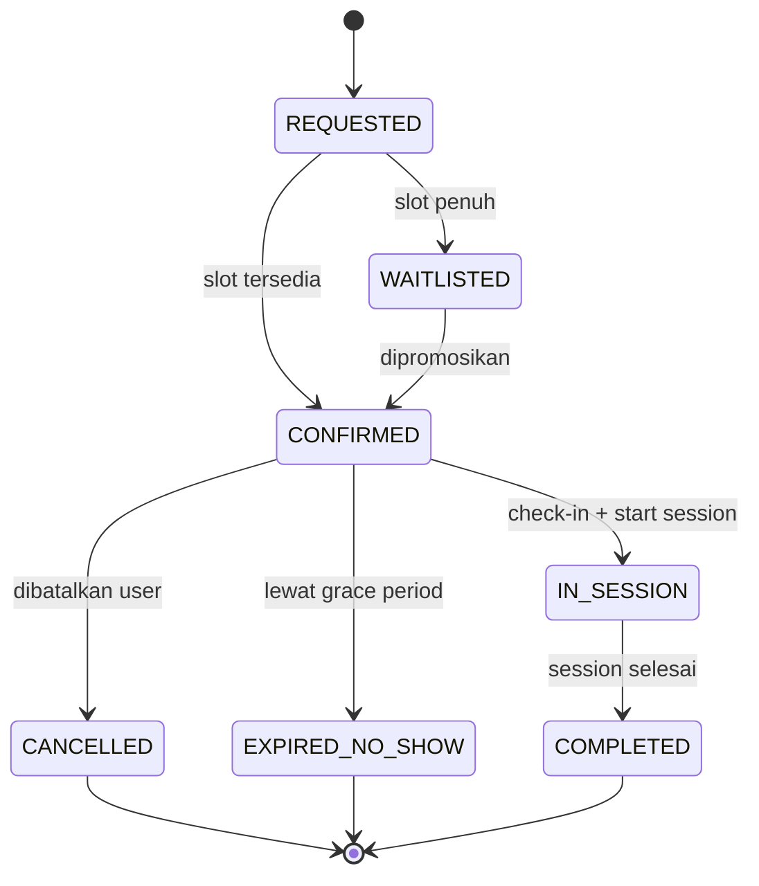

# Diagram Arsitektur dan Alur

## 1. Container Diagram (High Level)

## 2. Sequence Diagram Booking Saat Jam Sibuk

## 3. Sequence Diagram No-show Auto Release

## 4. Sequence Diagram Session dan Billing

## 5. State Diagram Booking

