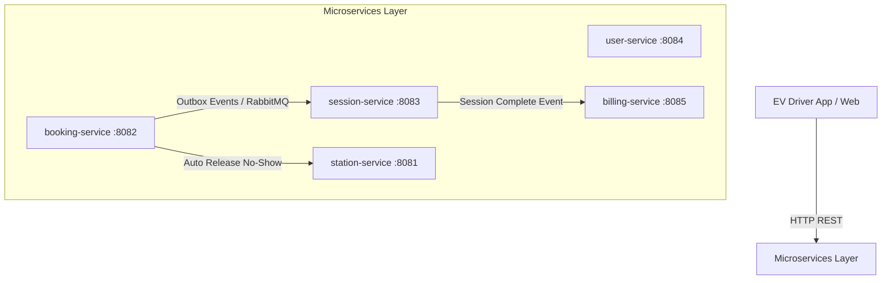
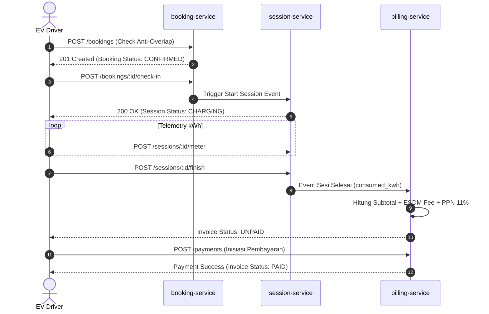

# Product Requirement Document (PRD)
## Sistem Booking Charger Kendaraan Listrik (SPKLU) Berbasis Event-Driven Microservices

- **Status**: APPROVED / READY FOR IMPLEMENTATION
- **Versi**: v1.0.0
- **Tanggal**: 2026-08-21
- **Domain**: System Booking SPKLU, Telemetry Charging, & Automatic Billing
- **Repository**: `Lab-Kelompok_12-Booking_Charger_Kendaraan_Listrik`

---

## 1. Executive Summary & Background

Meningkatnya populasi Kendaraan Listrik (Electric Vehicle / EV) di Indonesia memicu tingginya kebutuhan akan pengisian daya di stasiun SPKLU (Stasiun Pengisian Kendaraan Listrik Umum). Beberapa permasalahan utama di lapangan meliputi:
1. **Konflik Jadwal (Slot Overlap)** pada charger berkapasitas terbatas.
2. **Pengguna No-Show** yang memblokir charger tanpa kejelasan kedatangan.
3. **Antrean Tidak Adil** saat terjadi penumpukan kendaraan pada jam sibuk (*peak hours*).
4. **Ketidakakuratan Billing** yang belum mengintegrasikan regulasi tarif ESDM resmi (Fast & Ultra-Fast Charging) serta pajak daerah (PPN 11% & PPJ).

Sistem ini dirancang untuk mengatasi permasalahan tersebut melalui pendekatan **Event-Driven Microservices (Golang)** yang menjamin anti-overlap reservasi, antrean waitlist berbasis FIFO, pelepas slot otomatis, pelacakan konsumsi kWh real-time, dan generasi billing otomatis.

---

## 2. Product Goals & Target KPIs

| Goal | Target KPI |
|---|---|
| **Zero Slot Overlap** | 0% insiden bentrok jadwal pada slot charger yang sama |
| **Optimasi Okupansi Charger** | Slot no-show dilepas otomatis < 15 menit (*grace period*) |
| **Keadilan Antrean** | 100% antrean waitlist dialokasikan secara FIFO otomatis saat slot rilis |
| **Akurasi Billing** | 100% invoice dihitung sesuai pemakaian kWh aktual + Biaya Layanan ESDM + PPN 11% |
| **Kecepatan Respons API** | Latensi API pendaftaran & reservasi slot < 200ms pada P95 |

---

## 3. User Roles & Persona

1. **EV Driver (Pengguna Umum)**
   - Mendaftarkan akun & kendaraan listrik.
   - Mencari stasiun SPKLU terdekat beserta ketersediaan slot.
   - Melakukan reservasi slot pada waktu tertentu.
   - Melakukan check-in di lokasi & memantau real-time pengisian kWh.
   - Membayar invoice melalui QRIS/Virtual Account.

2. **SPKLU Station Operator / Admin**
   - Mengelola master data stasiun, slot charger, dan status operasional.
   - Menetapkan dan memperbarui tarif per kWh serta biaya layanan.

3. **System Background Worker / Cron Scheduler**
   - Memeriksa booking yang lewat *grace period* untuk otomatisasi status `EXPIRED_NO_SHOW`.
   - Mengirim sinyal alokasi slot rilis kepada antrean waitlist teratas (FIFO).

---

## 4. Architectural & System Boundaries

Sistem terdiri dari **5 Microservices terpisah**:

---

## 5. Detailed Functional Requirements (FR) per Service

### 5.1 `user-service` (Port `:8084`)
- **FR-US-01 (Auth)**: Mendukung `POST /auth/register` & `POST /auth/login` dengan enkripsi password (Bcrypt) dan pembuatan JWT Token.
- **FR-US-02 (User Profile)**: Mendukung pengambilan profil `GET /users/me` dan update `PUT /users/me`.
- **FR-US-03 (EV Vehicle Management)**: Mendukung manajemen kendaraan pengguna (`POST`, `GET`, `DELETE /users/me/vehicles`) mencakup merek, tipe konektor (CCS2, CHAdeMO, Type 2), dan kapasitas baterai (kWh).

### 5.2 `station-service` (Port `:8081`)
- **FR-SS-01 (Master Stasiun)**: Pengelolaan stasiun SPKLU (`GET /stations`, `POST /stations`, `PUT /stations/:id`, `DELETE /stations/:id`) lengkap dengan lokasi GPS.
- **FR-SS-02 (Slot Charger)**: Pengelolaan slot charger (`GET /stations/:id/slots`, `POST /stations/:id/slots`) beserta tipe konektor dan daya maksimal kW.
- **FR-SS-03 (Tarif ESDM)**: Pengelolaan struktur tarif (`GET /tariffs`, `POST /stations/:id/tariffs`) untuk penentuan harga per kWh dan biaya layanan.

### 5.3 `booking-service` (Port `:8082`)
- **FR-BS-01 (Anti-Overlap Booking)**: Memvalidasi bahwa tidak ada booking aktif lain pada `slot_id` yang sama untuk rentang `start_time` hingga `end_time`.
- **FR-BS-02 (FIFO Waitlist Fallback)**: Jika slot penuh, pengguna dapat masuk ke antrean `Waitlist` (`queue_number` bertambah secara acak/FIFO).
- **FR-BS-03 (Auto-Release No-Show)**: Endpoint `POST /bookings/auto-release?grace_period_minutes=15` untuk mengubah status booking menjadi `EXPIRED_NO_SHOW` jika pengguna belum check-in.
- **FR-BS-04 (Check-In)**: Endpoint `POST /bookings/:id/check-in` untuk memverifikasi lokasi pengemudi dan mengubah status booking menjadi `IN_SESSION`.

### 5.4 `session-service` (Port `:8083`)
- **FR-SE-01 (Start Session)**: Menginisiasi sesi pengisian daya `POST /sessions/start` terhubung dengan `booking_id`.
- **FR-SE-02 (Real-time Telemetry)**: Menerima pengiriman data meteran kWh real-time via `POST /sessions/:id/meter` (arus ampere, tegangan volt, daya kW).
- **FR-SE-03 (Finish Session)**: Menghentikan sesi `POST /sessions/:id/finish`, menghitung total `consumed_kwh`, dan mempublikasikan event penutupan sesi.

### 5.5 `billing-service` (Port `:8085`)
- **FR-BL-01 (Invoice Generation)**: Menghasilkan invoice `POST /invoices` dari total kWh konsumsi dengan formula:
  $$\text{Subtotal} = \text{consumed\_kwh} \times \text{price\_per\_kwh} + \text{service\_fee}$$
  $$\text{Tax (PPN 11\%)} = \text{Subtotal} \times 0.11$$
  $$\text{Total Invoice} = \text{Subtotal} + \text{Tax}$$
- **FR-BL-02 (Payment Processing)**: Menginisiasi transaksi pembayaran `POST /payments` (QRIS, VA, E-Wallet).
- **FR-BL-03 (Payment Webhook/Confirm)**: Menerima konfirmasi pembayaran `POST /payments/:id/confirm` dan mengubah status invoice menjadi `PAID`.

---

## 6. Non-Functional Requirements (NFR)

1. **Konsistensi Data (Eventual Consistency)**: Menggunakan **Transactional Outbox Pattern** untuk memastikan setiap event status disimpan di DB sebelum dipublikasikan ke message broker.
2. **Idempotensi API**: Seluruh API yang melakukan perubahan data (`POST /bookings`, `POST /payments`, `POST /sessions/start`) menerima header `X-Idempotency-Key` untuk mencegah duplikasi pesanan.
3. **Keamanan (Security)**: Semua endpoint dilindungi oleh JWT Authentication Middleware (kecuali `/auth/login` dan `/auth/register`).
4. **Reliabilitas**: Setiap service memiliki *health check* dan terisolasi pada port terpisah sehingga kegagalan 1 service tidak meruntuhkan service lain.

---

## 7. Matrices & Edge Cases Handling

| Skenario Edge Case | Potensi Masalah | Solusi & Mekanisme Sistem |
|---|---|---|
| **Simultaneous Booking** | 2 pengguna memesan slot & jam yang sama bersamaan | Database row-level locking / Redis lock pada slot & rentang jam |
| **No-Show Pengguna** | Pengguna membuat booking tapi tidak datang ke SPKLU | Worker `auto-release` mengubah status ke `EXPIRED_NO_SHOW` dalam 15 menit & alokasi slot ke Waitlist #1 |
| **Sputtering Meter Telemetry** | Koneksi charger terputus saat pengisian | `session-service` menyimpan snapshot terakhir pembacaan meter kWh |
| **Double Payment Request** | Pengguna menekan tombol bayar 2x | Proteksi `idempotency_key` pada `billing-service` menolak request kedua |

---

## 8. Urutan Eksekusi (User Flow Sequence Diagram)

---

## 9. Rencana Tahapan Implementasi (Roadmap)

- [x] **Fase 1: Arsitektur & Core Domain Model** (Selesai pada dokumentasi dasar)
- [x] **Fase 2: REST Endpoint Structuring** (Seluruh endpoint di 5 microservices terdaftar)
- [ ] **Fase 3: Implementasi Integration Test & TDD** (Pengetesan anti-overlap & billing calculation)
- [ ] **Fase 4: Production Readiness** (Docker Compose orchestration & deployment)
